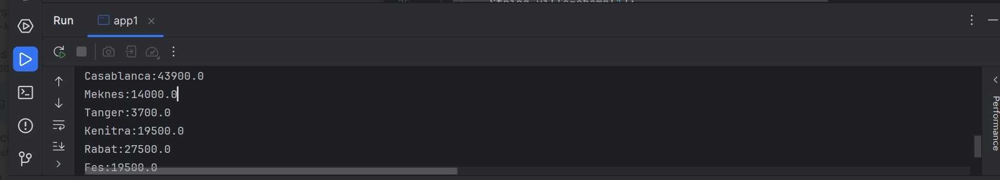
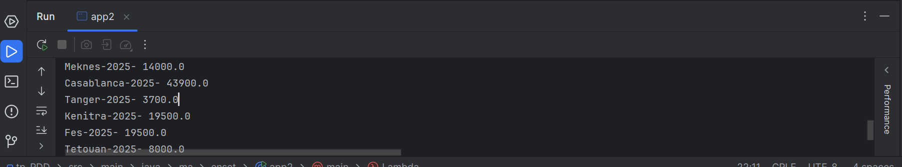
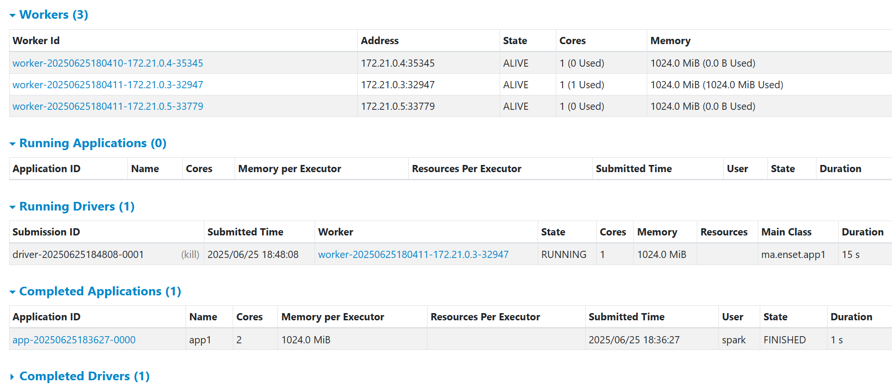
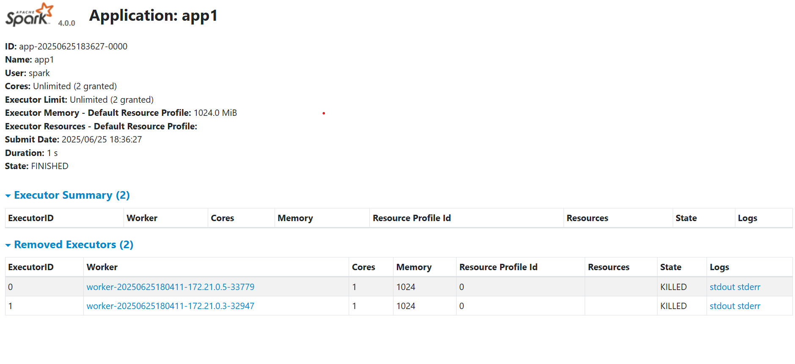
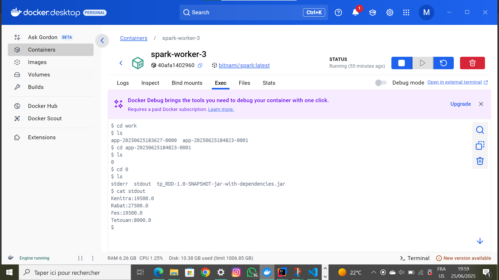
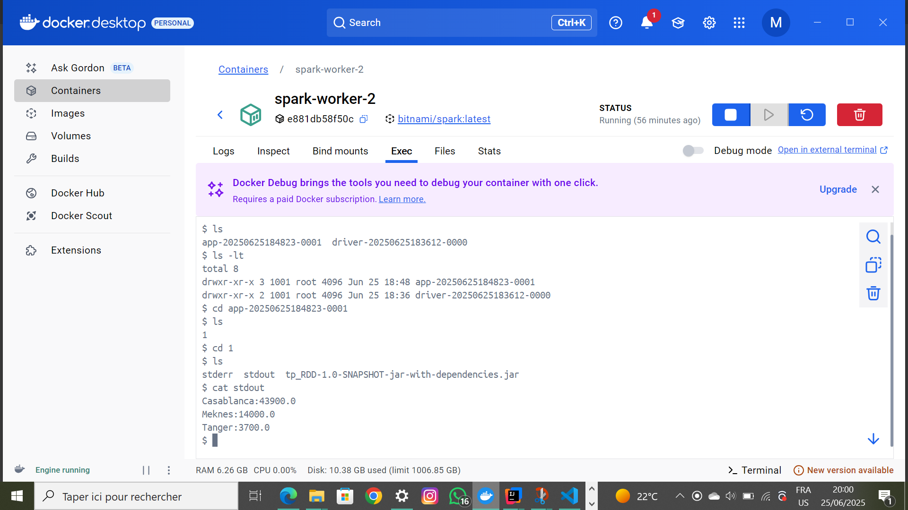

<h1>Traitement parallèle et distribué avec Spark</h1>
<h3>Total des ventes par ville en mode local</h3>

<h3>Le prix total des ventes des produits par ville et par année</h3>

<h3>le total des ventes par ville sur le cluster</h3>

